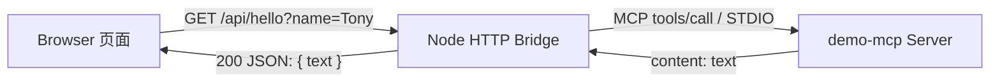

# MCP Web 页面链路设计

## 目标

这个页面用于把 `demo-mcp` 的 `hello` 工具结果显示在浏览器中。浏览器不读取
Codex 终端文本，也不直接启动 STDIO 进程。Node Web Bridge 负责 HTTP 与 MCP
之间的协议转换。

## 运行链路



页面运行时不经过 Codex 模型：

```text
浏览器 -> HTTP Bridge -> STDIO MCP -> hello 工具
浏览器 <- JSON          <- MCP content <- 工具结果
```

Codex 在这里的作用是开发、调试和验证 MCP；真正打开页面后，MCP Client 是
`src/web-server.ts` 创建的 Node 进程。

## 一次请求的完整过程

1. 用户在页面输入姓名并提交表单。
2. `public/index.html` 请求 `/api/hello?name=<姓名>`。
3. HTTP Bridge 去除姓名两侧空白，并校验长度为 1-80 个 Unicode 字符。
4. Bridge 通过 MCP SDK 调用 `hello`，参数为 `{ "name": "Tony" }`。
5. `src/index.ts` 返回 MCP `content` 数组中的文本内容。
6. Bridge 提取第一个文本内容，返回 `{ "text": "你好，Tony!" }`。
7. 页面检查 HTTP 状态，并通过 `textContent` 显示文本。

## API 契约

成功请求：

```http
GET /api/hello?name=Tony
```

```json
{"text":"你好，Tony!"}
```

输入错误返回 HTTP `400`：

```json
{"error":"Name is required."}
```

MCP 启动或调用失败返回 HTTP `502`：

```json
{"error":"MCP tool call failed."}
```

## 文件职责

| 文件 | 职责 |
| --- | --- |
| `src/index.ts` | 注册并运行 STDIO MCP Server，暴露 `hello` 工具 |
| `src/web-helpers.ts` | 姓名校验与 MCP 文本提取 |
| `src/web-server.ts` | 启动 MCP Client、提供 HTTP API、提供静态页面 |
| `public/index.html` | 输入姓名、请求 API、渲染加载/成功/错误状态 |
| `test/mcp-bridge.test.ts` | 验证真实 STDIO MCP 连接和工具调用 |
| `test/web-server.test.ts` | 验证 HTTP 状态码、JSON 和静态页面 |
| `test/web-runtime.test.ts` | 验证完整 Web 进程、真实 MCP 调用和关闭流程 |

## 本地运行

```bash
cd /Users/tonyn/Documents/Codex/2026-07-08/ru/demo-mcp
npm run web
```

打开：

```text
http://127.0.0.1:3000
```

停止服务：

```text
Ctrl+C
```

端口被占用时，可以临时更换端口：

```bash
PORT=3001 npm run web
```

## 与 Codex 配置的关系

`npm run web` 不读取或修改 `~/.codex/config.toml`，也不会让 `demo_mcp`
出现在当前 Codex 任务的 MCP 列表中。它只在 Web Bridge 的生命周期内启动一个
本地 MCP 子进程，停止 Web Bridge 后子进程一并关闭。

## 排查顺序

1. 页面打不开：确认终端仍在运行 `npm run web`。
2. 浏览器显示 `502`：查看启动服务的终端是否存在 MCP 启动错误。
3. 浏览器显示 `400`：确认姓名不是空字符串，且不超过 80 个字符。
4. `3000` 端口占用：使用 `PORT=3001 npm run web` 后访问新端口。
5. 修改 TypeScript 后行为没更新：重新运行 `npm run web`，它会先执行构建。
