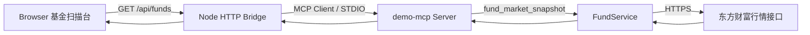

# MCP 基金行情页面链路

## 目标

`demo-mcp` 是一个可在 Codex、MCP Inspector 和浏览器中测试的本地 MCP 示例。页面当前
聚焦国内公募基金，覆盖场内 ETF/LOF 与场外开放式基金，支持任意代码、名称、指数和行业关键词。

## 实际运行链路



网页使用 React + Vite + Mantine 构建，不直接启动 STDIO，也不绕过 MCP Client。`src/web-server.ts` 启动一个 MCP Client，
通过 `tools/call` 调用 `src/index.ts` 注册的工具；MCP 服务再调用 `FundService`，由 Node
适配器读取东方财富真实数据。

## 两种数据模式

默认模式是真实行情：

```text
npm run web
```

固定样本只用于离线预览和自动测试：

```text
npm run web:sample
```

真实模式目前使用：

- 东方财富 ETF 行情：场内 ETF 最新价、IOPV、涨跌幅、成交量和成交额。
- 东方财富开放式基金净值与排行：场外正式单位净值、日增长率和真实区间收益。
- 东方财富指数与行业资金流向：指数收盘数据和行业主力净流向。

行业资金“流入合计”和“流出合计”分别汇总行业净流向正值和负值，二者差额为净流向；
它们不是市场总成交资金流入与流出。接口没有返回的历史区间保持为空，不使用推算值。

## 查询工具契约

### `fund_market_snapshot`

```json
{
  "keyword": "半导体",
  "matchBy": "industry",
  "market": "off_exchange",
  "sort": "change_desc",
  "limit": 20
}
```

返回统一结构：

```json
{
  "keyword": "半导体",
  "matchBy": "industry",
  "market": "off_exchange",
  "dataDate": "2026-07-10",
  "updatedAt": "2026-07-12T11:00:00+08:00",
  "items": [{
    "code": "001480",
    "name": "财通成长优选混合A",
    "market": "off_exchange",
    "nav": 8.412,
    "changePercent": -4.49,
    "periodChanges": {
      "today": -4.49,
      "yesterday": 4.9202,
      "week": -8.56,
      "half_month": -18.5357,
      "month": 3.08
    },
    "officialNavAvailable": true,
    "source": "东方财富开放式基金净值"
  }]
}
```

### `fund_detail`

参数为六位 `code`，返回单只基金的统一行情字段、区间收益和来源。查询不到时，MCP 返回
可识别的错误 JSON，Web Bridge 映射为 `404`。

## 页面步骤状态

1. 填写筛选条件：选择关键词匹配字段、市场、排序和数量。
2. 浏览器发起请求：页面调用 `GET /api/funds`。
3. Bridge 调用 MCP：Node MCP Client 通过 STDIO 请求 `fund_market_snapshot`。
4. 渲染行情结果：结果表展示市场、价格/净值、涨跌幅、日期和详情入口。

每一步有可见停留时间，用户能感知进度；“重置”会取消旧请求的渲染，避免旧响应覆盖新状态。

## 文件职责

| 文件 | 职责 |
| --- | --- |
| `src/index.ts` | 注册 `hello`、`fund_market_snapshot`、`fund_detail` MCP 工具 |
| `src/fund-types.ts` | 统一基金行情、详情和快照数据结构 |
| `src/fund-helpers.ts` | 参数解析、关键词匹配、市场过滤、排序和正式净值判断 |
| `src/fund-service.ts` | 获取真实 ETF、场外净值与区间排行，并生成快照/详情 |
| `src/market-service.ts` | 获取指数和行业主力净流向 |
| `python/fund_adapter.py` | 仅用于固定样本和兼容性测试 |
| `src/web-server.ts` | MCP Client、HTTP API 和静态页面 |
| `web/App.tsx` | React 基金行情工作台状态、筛选、Tab、重置和请求生命周期 |
| `web/components/` | Mantine 筛选栏、结果表、今日概览、详情 Drawer 和 MCP 链路 Drawer |
| `web/api.ts` | React 侧基金快照与详情 API 请求 |
| `web/index.html` | Vite React 入口 |
| `test/` | 单元、MCP Bridge、HTTP API 和页面契约测试 |

## HTTP 接口

```text
GET /api/funds?keyword=半导体&matchBy=industry&market=off_exchange&sort=change_desc&limit=20
GET /api/funds/012345
```

基金参数错误返回 `400`，数据源或 MCP 调用错误返回 `502`，详情不存在返回 `404`。

## 与 Codex 的关系

`npm run web` 不会修改 `~/.codex/config.toml`，只在 Web Bridge 生命周期内启动本地 MCP
子进程。需要让 Codex 当前任务直接使用工具时，应把 `build/src/index.js` 配置成 MCP Server；
浏览器预览则使用本项目内置的 MCP Client。两条路径共用同一组 MCP 工具，但不会互相读取终端输出。
