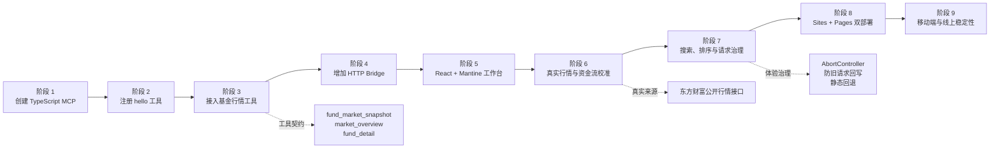
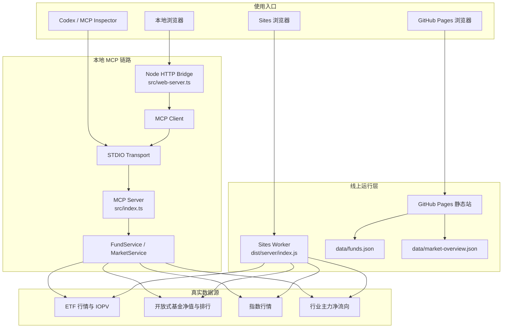
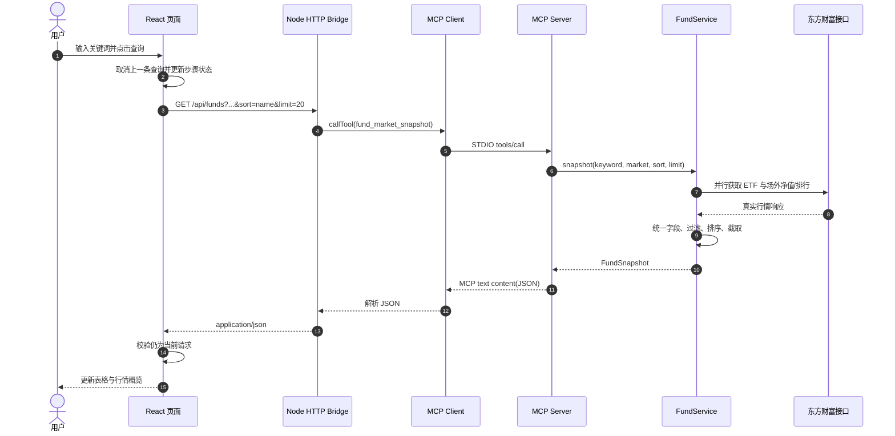
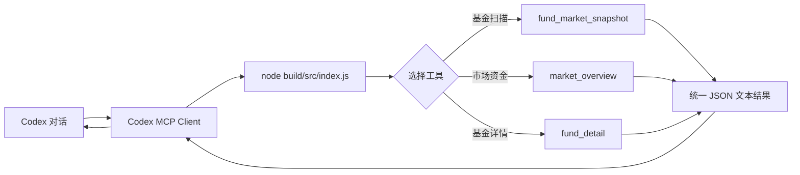
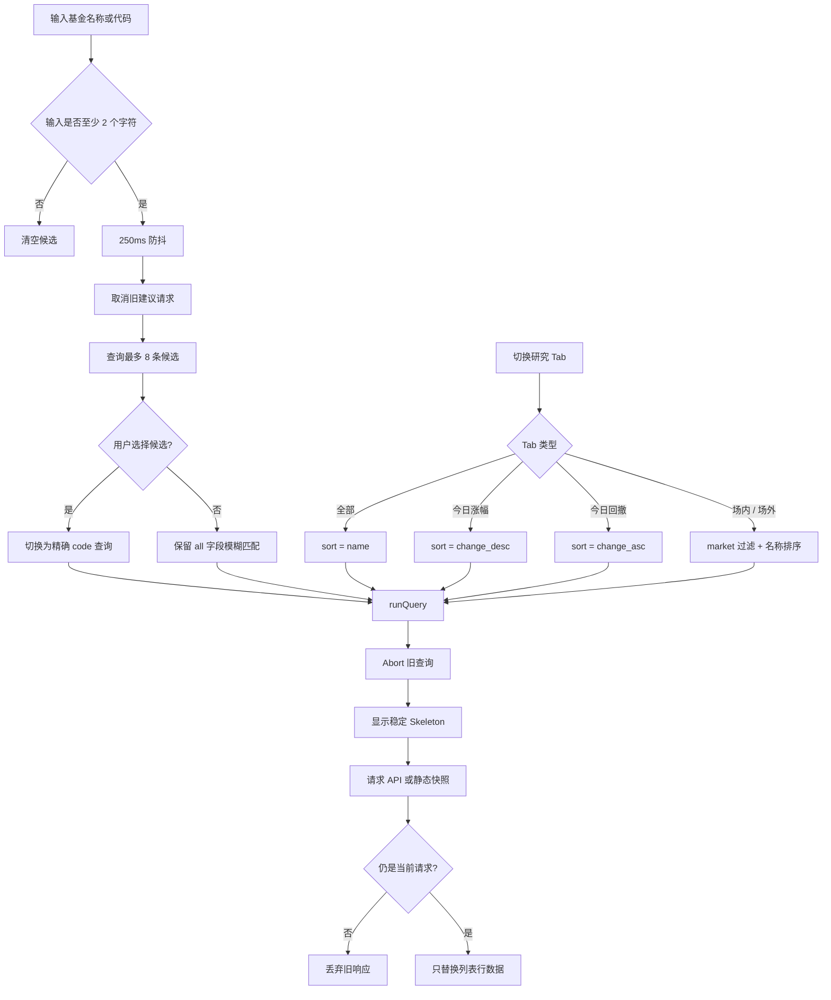
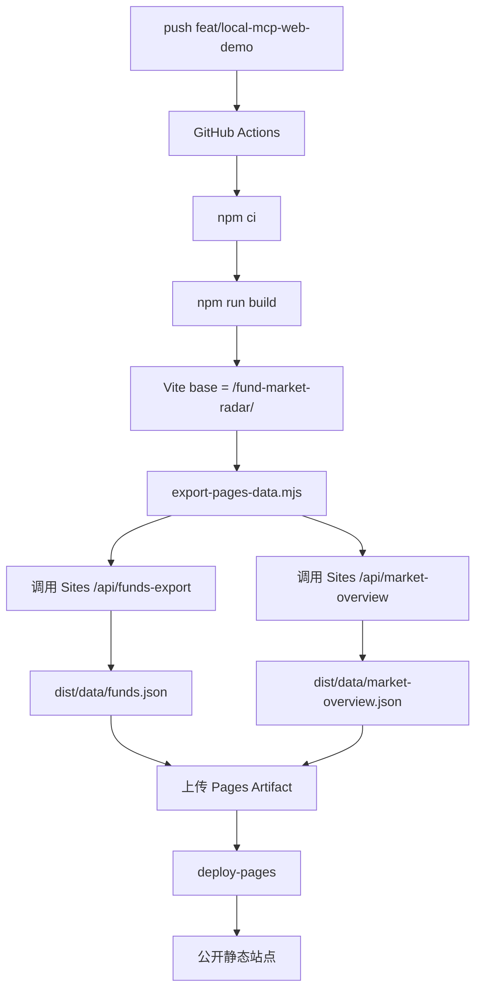
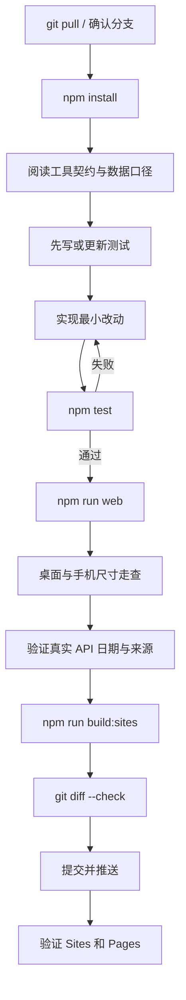

# 公募基金市场雷达开发全流程

> [!summary] 一句话说明
> 这是一个把 Codex/MCP、React 数据工作台和国内公募基金真实行情连接起来的完整示例：本地链路通过 STDIO MCP 调用工具，Sites 提供动态线上 API，GitHub Pages 使用部署时导出的真实行情快照作为稳定公开入口。

## 1. 项目成果与入口

| 项目 | 地址或命令 | 用途 |
| --- | --- | --- |
| GitHub 仓库 | [Antony-Juicy/fund-market-radar](https://github.com/Antony-Juicy/fund-market-radar) | 代码、Actions、版本历史 |
| Sites 动态站点 | [fund-market-radar.gabbiyabbiy9.chatgpt.site](https://fund-market-radar.gabbiyabbiy9.chatgpt.site/) | 动态查询真实行情与市场概览 |
| GitHub Pages | [antony-juicy.github.io/fund-market-radar](https://antony-juicy.github.io/fund-market-radar/) | 面向手机和公开访问的稳定快照入口 |
| 本地 React 页面 | `npm run web` 后访问 `http://127.0.0.1:3000` | 验证 Browser -> HTTP -> MCP -> 数据源完整链路 |
| MCP Inspector | `npx @modelcontextprotocol/inspector node build/src/index.js` | 独立检查 MCP 工具契约 |
| 测试 | `npm test` | TypeScript 构建、单元测试、MCP/HTTP 集成测试 |

## 2. 从 Demo 到产品化原型的开发阶段



### 阶段说明

1. **MCP 最小闭环**：使用 `@modelcontextprotocol/sdk` 创建 STDIO Server，用 `hello` 验证 Client/Server 通信。
2. **基金领域工具**：加入基金快照、市场概览和基金详情三个工具，并使用 Zod 约束输入。
3. **浏览器可视化**：浏览器不能直接稳定管理 STDIO 子进程，因此增加 Node HTTP Bridge，在服务器内部启动 MCP Client。
4. **React 工作台**：使用 React、Vite、Mantine 和 Tabler Icons 构建查询、概览、详情与调用链抽屉。
5. **数据真实性校准**：场内、场外、指数和行业资金均切换到东方财富公开接口；接口未返回的字段保持为空，不伪造历史数据。
6. **交互稳定性**：搜索建议使用防抖；查询、建议和详情分别管理 AbortController，避免旧请求覆盖新状态。
7. **双部署**：Sites 负责动态 API；GitHub Pages 在 CI 中导出真实快照，规避部分网络环境对动态域名的访问限制。

## 3. 总体架构图



> [!important] 架构边界
> 本地 `npm run web` 会真实经过 MCP Client 和 STDIO MCP Server。Sites 为适应无服务器运行环境，由构建脚本生成 Worker 并直接访问数据源，不启动 STDIO 子进程。GitHub Pages 没有后端，只读取部署时导出的 JSON 快照。

## 4. 本地浏览器查询时序



### 为什么需要 HTTP Bridge

- Browser 的 `fetch` 只理解 HTTP，不直接管理 STDIO MCP 生命周期。
- `src/web-server.ts` 同时承担静态资源服务、HTTP 参数校验和 MCP Client 连接。
- Bridge 不实现基金业务，只负责把 HTTP 请求翻译成 MCP `tools/call`，再把 MCP 文本结果解析为 JSON。
- 关闭 Web Server 时同步关闭 MCP Client 和子进程，避免残留进程。

## 5. Codex 直接调用 MCP 的链路



临时测试可以使用 Codex CLI 的单次配置参数，不需要永久写入用户配置。永久接入时才把 `build/src/index.js` 注册为 MCP Server。

## 6. React 页面内部状态流



### 关键交互规则

- “全部”使用 `name` 中性排序，不能再隐式等同于涨幅榜。
- “今日涨幅”和“今日回撤”只改变排序方向，不混入搜索关键词。
- 选择六位基金代码后使用精确 `code` 查询；改回主题词时自动恢复 `all` 字段匹配。
- 列表加载时保持表头和列宽不变，仅行内容显示 Skeleton，避免布局抖动。
- 查询、建议、详情使用独立 AbortController；只有当前 Controller 可以写回状态。
- 重置会取消旧请求，恢复默认查询、默认 Tab 和默认周期。

## 7. MCP 工具契约

| 工具 | 输入 | 输出 | 主要实现 |
| --- | --- | --- | --- |
| `hello` | `name` | 中文问候文本 | `src/greeting.ts` |
| `fund_market_snapshot` | `keyword`、`matchBy`、`market`、`sort`、`limit` | `FundSnapshot` | `src/fund-service.ts` |
| `market_overview` | 无 | 指数、行业流入/流出、比例 | `src/market-service.ts` |
| `fund_detail` | 六位 `code` | 单只基金统一详情 | `FundService.getDetail` |

`fund_market_snapshot` 的典型请求：

```json
{
  "keyword": "创业板ETF",
  "matchBy": "all",
  "market": "all",
  "sort": "name",
  "limit": 20
}
```

## 8. 真实数据来源与口径

| 数据 | 来源 | 页面字段 | 更新特点 |
| --- | --- | --- | --- |
| 场内 ETF | 东方财富 ETF 行情 | 最新价、IOPV/净值、涨跌幅、成交量、成交额 | 交易时段更新；本地缓存 5 分钟，Sites 缓存 2 分钟 |
| 场外公募 | 东方财富开放式基金净值 | 正式单位净值、日增长率、数据日期 | 通常收盘后更新 |
| 基金区间收益 | 东方财富基金排行 | 昨日、近 1 周、近 15 天、近 1 月 | 只保留接口明确返回的数据 |
| 大盘指数 | 东方财富指数行情 | 上证指数、深证成指、创业板指 | 展示最近行情时间 |
| 行业资金 | 东方财富行业资金流向 | 流入板块、流出板块、净流向、占比 | 按行业主力净流向正负汇总 |

> [!warning] 资金流口径
> “流入合计”是行业主力净流向为正的板块之和，“流出合计”是净流向为负的板块绝对值之和。它们不是市场总买入额和总卖出额。流入/流出占比按两者绝对值总和计算。

### 数据处理流程


## 9. 三种运行模式

| 模式 | 请求路径 | 是否实时 | 是否经过 MCP | 适用场景 |
| --- | --- | --- | --- | --- |
| 本地 Web | React -> HTTP Bridge -> MCP Client -> STDIO Server -> 东方财富 | 是 | 是 | 开发、MCP 链路教学、集成测试 |
| Sites | React -> Sites Worker -> 东方财富 | 是 | 否 | 动态线上站点与 Pages 快照数据源 |
| GitHub Pages | React -> `dist/data/*.json` | 部署时真实快照 | 否 | 手机、公开访问、动态域名受限时的稳定入口 |

GitHub Pages 运行时通过 `shouldPreferStaticData(hostname)` 识别 `github.io`，直接读取静态快照，不先等待动态域名失败。

## 10. Sites 动态部署流程

```mermaid
flowchart LR
    A["npm run build"] --> B["Vite 生成 dist 静态资源"]
    B --> C["build-sites-worker.mjs"]
    C --> D["把 HTML/CSS/JS 嵌入 Worker"]
    D --> E["实现 /api/funds 等动态路由"]
    E --> F["npm run build:sites"]
    F --> G["打包站点归档"]
    G --> H["推送 Sites Source Repository"]
    H --> I["保存 Site Version"]
    I --> J["部署 Production Version"]
    J --> K["轮询状态并验证 URL/API"]
```



Sites Worker 提供：

- `GET /api/funds`
- `GET /api/funds-export`
- `GET /api/funds/:code`
- `GET /api/market-overview`

## 11. GitHub Pages 部署流程



导出脚本包含超时和重试；若动态 API 无法导出真实数据，工作流应失败，不能悄悄发布伪造数据。

## 12. 目录与职责

| 路径 | 职责 |
| --- | --- |
| `src/index.ts` | MCP Server 入口与工具注册 |
| `src/fund-service.ts` | 真实基金适配器、缓存、快照和详情 |
| `src/market-service.ts` | 指数与行业资金流向 |
| `src/fund-helpers.ts` | 参数校验、关键词匹配、过滤、排序 |
| `src/fund-search.ts` | 搜索候选、精确代码查询、Tab 查询语义 |
| `src/web-server.ts` | 本地 HTTP Bridge、MCP Client、静态资源服务 |
| `src/request-control.ts` | 可取消延迟与当前请求判断 |
| `src/pages-fallback.ts` | Pages 快照过滤与排序 |
| `src/runtime-data-source.ts` | GitHub Pages 静态数据优先策略 |
| `web/App.tsx` | 页面总状态、查询、重置、详情和请求生命周期 |
| `web/api.ts` | 动态 API、超时与静态回退 |
| `web/components/` | 筛选、列表、概览、详情、链路抽屉 |
| `scripts/build-sites-worker.mjs` | 生成 Sites Worker 运行入口 |
| `scripts/export-pages-data.mjs` | 导出 GitHub Pages 真实数据快照 |
| `.github/workflows/deploy-pages.yml` | GitHub Pages CI/CD |
| `test/` | 单元、MCP、HTTP、页面数据策略测试 |

## 13. 本地开发标准流程



### 常用命令

```bash
npm install
npm test
npm run web
npm run web:sample
npm run build:sites
npm run export:pages-data
```

## 14. 测试覆盖地图

| 测试 | 防止的问题 |
| --- | --- |
| `fund-helpers.test.ts` | 参数、过滤、排序、净值日期错误 |
| `fund-ranking.test.ts` | 历史区间解析和伪造数据 |
| `fund-search.test.ts` | 搜索候选、代码匹配、Tab 排序语义 |
| `fund-service.test.ts` | 适配器与快照服务回归 |
| `mcp-bridge.test.ts` | MCP Client/Server 工具调用失败 |
| `web-server.test.ts` | HTTP 状态码、参数、静态页面路由 |
| `web-runtime.test.ts` | 本地运行链路没有真正调用 MCP |
| `pages-fallback.test.ts` | Pages 静态快照查询与排序错误 |
| `request-control.test.ts` | 取消请求后仍回写 UI |
| `runtime-data-source.test.ts` | GitHub Pages 错误访问动态域名 |

## 15. 发布前校验清单

- [ ] `npm test` 全部通过。
- [ ] `npm run build:sites` 成功并生成 `dist/server/index.js`。
- [ ] `git diff --check` 无空白错误。
- [ ] 本地 `GET /api/funds` 返回真实 `source`、`dataDate`、`updatedAt`。
- [ ] “全部”使用名称排序，同时可看到上涨与下跌基金。
- [ ] “今日涨幅”和“今日回撤”排序方向正确。
- [ ] 搜索“创业板ETF”能返回名称或代码匹配结果。
- [ ] 快速重复搜索不会出现旧结果覆盖新结果。
- [ ] Sites 首页和四个 API 路由可访问。
- [ ] Pages 首页、`data/funds.json`、`data/market-overview.json` 返回 200。
- [ ] 手机端不出现 `Failed to fetch`。
- [ ] 页面明确显示数据日期与来源，不把快照伪装成实时行情。

## 16. 常见故障定位

### 16.1 “全部”为什么只显示上涨基金

检查请求中的 `sort`。旧逻辑把“全部”映射为 `change_desc`，只取前 20 条时就会看起来全部上涨。当前规则是：

- 全部：`sort=name`
- 今日涨幅：`sort=change_desc`
- 今日回撤：`sort=change_asc`

### 16.2 手机端显示 `Failed to fetch`

1. 检查动态 Sites 域名是否被当前网络或 Cloudflare 拦截。
2. GitHub Pages 应直接加载 `/fund-market-radar/data/*.json`，不等待 Sites 请求失败。
3. 检查 Pages Action 是否成功导出快照以及 Vite `base` 是否包含仓库路径。

### 16.3 查询时列表或右侧概览抖动

- 表头必须始终渲染，Skeleton 只替换表格行。
- 搜索按钮保持固定宽高，加载时只替换内部图标。
- 右侧概览使用稳定布局，不应因为主列表 loading 改变顶部偏移。
- 旧请求必须 Abort，并在写状态前通过 `isActiveRequest`。

### 16.4 市场资金数据看起来对不上

- 确认比较的是同一 `dataDate`。
- 流入/流出为行业净流向正负汇总，不是总成交买卖额。
- `netFlow = inflowTotal - outflowTotal`。
- `inflowRatio + outflowRatio` 应约等于 100%，允许显示四舍五入误差。

## 17. 当前架构风险与后续方向

1. **本地 MCP 与 Sites Worker 有两套数据实现**：字段或排序规则修改时必须同步验证，长期可抽取共享纯函数或生成 Worker 模块。
2. **Pages 快照只在工作流执行时更新**：若要准实时公开访问，可增加定时 Actions，或使用自有域名和稳定后端。
3. **上游公开接口可能变更**：解析器应保持契约测试，并在错误时明确失败，不回退到虚构值。
4. **基金详情行业配置仍为空数组**：只有接入可核验的持仓/行业来源后才能展示。
5. **当前页面不是投资建议系统**：排序与资金观察仅用于研究比较，不能输出买入推荐结论。

## 18. 维护规则

每次修改以下内容时同步更新本文：

- MCP 工具名称、输入或输出结构。
- 数据源、缓存时间、资金流统计口径。
- React 搜索、Tab、排序、重置或详情交互。
- Sites Worker API 路由。
- GitHub Pages 导出策略和线上地址。
- 新增部署环境、域名或环境变量。

仓库文档更新后，用下面的命令同步 Obsidian 副本：

```bash
cp docs/project-development-flow.md \
  "/Users/tonyn/Documents/Obsidian Vault/项目/公募基金市场雷达-开发全流程.md"
```

---

## 关联入口

仓库版本：[docs/project-development-flow.md](https://github.com/Antony-Juicy/fund-market-radar/blob/feat/local-mcp-web-demo/docs/project-development-flow.md)

线上版本：[Sites 动态站点](https://fund-market-radar.gabbiyabbiy9.chatgpt.site/) · [GitHub Pages 稳定入口](https://antony-juicy.github.io/fund-market-radar/)
