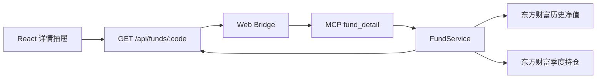

# 基金持仓与业绩曲线详情设计

## 目标

将现有仅展示基金代码、市场、涨跌幅和来源的详情抽屉，升级为可用于研究的基金详情视图：

- 展示最新披露季度的前十大股票持仓。
- 展示基金自身在近 15 天、近 1 月、近 3 月、近 1 年和今年以来的累计收益曲线。
- 所有展示数据来自真实上游接口；缺失字段保持缺失，不推算或伪造。
- 本地 MCP、Sites 动态站点和 GitHub Pages 静态前端使用一致的数据契约。

本功能用于研究和比较，不构成投资建议。

## 范围

### 包含

- 场内 ETF 和场外开放式公募基金的历史净值序列。
- 基金最新披露季度的前十大股票持仓。
- 区间累计收益计算和曲线切换。
- 详情接口缓存、独立加载态、错误态和空数据态。
- 桌面端详情抽屉和移动端全屏详情。
- Sites 动态接口及 GitHub Pages 跨域详情读取。

### 不包含

- 跟踪指数或业绩比较基准曲线。
- 实时估算持仓、盘中持仓变化或基金经理调仓推断。
- 债券持仓、行业配置和资产配置扩展。
- 买卖建议、基金评分或收益预测。

## 数据口径

### 股票持仓

数据取自东方财富天天基金基金档案的基金持仓接口。接口返回指定基金的季度股票投资明细，包括股票代码、股票名称、占净值比例、持股数、持仓市值和季度。

详情只展示最新可用报告期的前十条持仓，并返回明确的 `reportDate`。持仓属于定期报告披露数据，不代表当前实时仓位。页面必须显示“季度披露数据，非实时持仓”。

参考：

- [AKShare 基金持仓接口说明](https://akshare.akfamily.xyz/data/fund/fund_public.html)
- 东方财富基金档案：`https://fundf10.eastmoney.com/FundArchivesDatas.aspx?type=jjcc&code={code}&topline=10&year=&month=`

### 历史业绩

历史数据取自东方财富基金历史净值接口。场内 ETF 和场外基金都优先读取累计净值；累计净值缺失时才使用单位净值。接口至少拉取最近一年之前额外 10 个自然日的数据，以便找到区间边界前后的有效交易日。

参考：

- [AKShare 开放式基金历史数据说明](https://akshare.akfamily.xyz/data/fund/fund_public.html)
- [AKShare 场内交易基金历史数据说明](https://akshare.akfamily.xyz/data/fund/fund_public.html)
- 东方财富历史净值：`https://api.fund.eastmoney.com/f10/lsjz?fundCode={code}&pageIndex=1&pageSize={size}&startDate={start}&endDate={end}`

### 累计收益算法

每个区间从筛选后的第一条有效净值开始归一化：

```text
累计收益率 = (当前累计净值 / 区间首日累计净值 - 1) * 100
```

区间定义：

- `half_month`：最新数据日向前 15 个自然日。
- `month`：最新数据日向前 1 个月。
- `quarter`：最新数据日向前 3 个月。
- `year`：最新数据日向前 1 年。
- `year_to_date`：最新数据日所在年份的 1 月 1 日起。

边界日期没有净值时，使用边界之后第一条有效记录。少于两条记录时不绘制曲线，显示“该区间历史数据不足”。

## 数据契约

### 持仓结构

```ts
interface FundStockHolding {
  rank: number;
  stockCode: string;
  stockName: string;
  navRatio: number;
  sharesWan?: number;
  marketValueWan?: number;
  reportDate: string;
}
```

### 历史点结构

```ts
interface FundPerformancePoint {
  date: string;
  value: number;
  unitNav?: number;
  cumulativeNav?: number;
}
```

`value` 是用于计算曲线的真实净值：优先累计净值，缺失时使用单位净值。

### 详情结构

```ts
interface FundDetail extends FundQuote {
  industryAllocation: FundIndustryAllocation[];
  stockHoldings: FundStockHolding[];
  holdingsReportDate?: string;
  performanceHistory: FundPerformancePoint[];
  performanceSource: string;
  availability: {
    holdings: "available" | "empty" | "unavailable";
    performance: "available" | "empty" | "unavailable";
  };
}
```

字段缺失时返回空数组或省略可选字段，不用 `0` 代替未发布数据。`empty` 表示上游正常返回但基金没有该类数据；`unavailable` 表示上游请求或解析失败，两者不得混用。

## 架构与请求链路

### 本地 MCP 与 Web



现有详情路由保持不变，仅扩展响应字段，避免增加前端并发请求和额外状态协调。

### Sites 与 GitHub Pages

Sites Worker 实现同样的详情聚合逻辑，并为跨域响应保留 CORS 头。GitHub Pages 在列表和市场概览上继续优先使用静态数据，但基金详情改为请求 Sites 的动态详情接口；动态接口不可用时，仍显示静态基础行情并为持仓和曲线展示独立错误提示。

## 缓存与稳定性

- 单只基金详情缓存 10 分钟。
- 相同基金的并发请求复用同一个进行中的 Promise。
- 上游请求设置 15 秒超时。
- 历史净值和持仓通过 `Promise.allSettled` 并行请求，单项失败不抹除基础行情，并通过 `availability` 暴露准确状态。
- 前端使用 `AbortController`；关闭抽屉或快速切换基金时取消旧请求。
- 数据源错误必须显示可重试状态，不回退到示例持仓或示例曲线。

## 详情界面

### 布局

桌面端抽屉宽度约 560px，移动端占满视口。内容从上到下分为：

1. 基金名称、代码、市场、最新净值或价格、最新涨跌幅、数据日期。
2. 业绩走势区域。
3. 前十大重仓股区域。
4. 数据来源和风险提示。

### 业绩走势

- 使用分段控件切换五个时间区间。
- 标题旁展示当前区间累计收益。
- 使用 Recharts 绘制响应式面积图，并由 Mantine 承载分段控件、骨架屏和错误状态。
- 悬停或触摸时显示日期、真实净值和区间累计收益。
- 正收益使用红色，负收益使用绿色，零轴始终可见。
- 切换时间区间不重新请求网络，只筛选详情接口返回的历史序列。

### 重仓股

- 标题展示报告日期和“季度披露”标签。
- 每行展示名次、股票名称、代码、占净值比例。
- 使用轻量比例条增强持仓权重辨识度。
- 持股数和持仓市值在桌面端作为次要信息展示；移动端优先保留占净值比例。
- 没有股票持仓时显示“该基金暂未披露股票持仓”，不将债券基金误判为接口失败。

## 加载、错误与空状态

- 打开详情后立即显示稳定宽高的骨架屏，抽屉尺寸不抖动。
- 基础详情、曲线、持仓分别有状态边界。
- 曲线失败时保留持仓；持仓失败时保留曲线。
- 提供统一的“重新加载详情”操作。
- 错误文本区分“上游暂不可用”“基金不存在”“该区间数据不足”和“暂无股票持仓”。

## 测试策略

### 数据解析

- 使用固定的东方财富历史净值响应片段测试日期、单位净值和累计净值解析。
- 使用固定的基金持仓 HTML 响应片段测试最新报告期和前十大持仓解析。
- 验证缺失数字不会转换为 `0`。

### 收益计算

- 先写失败测试验证五个区间筛选。
- 验证区间首日归一为 `0%`。
- 验证正负收益、闰年、跨年和数据不足场景。

### 接口与部署

- 验证 `/api/funds/:code` 返回扩展后的详情契约。
- 验证上游单项失败时仍返回可用的部分详情及明确状态。
- 验证 Sites Worker 包含详情路由、CORS 和缓存逻辑。
- 验证 GitHub Pages 的详情请求指向动态 Sites 接口，而不是伪造静态持仓。

### 前端

- TypeScript 和生产构建通过。
- 使用 Playwright 验证桌面与移动端抽屉、区间切换、图表提示和关闭行为。
- 检查抽屉打开、加载完成和切换区间时无明显布局抖动。

## 验收标准

- 任意可查询的场内 ETF 或场外基金打开详情后，能够看到真实历史业绩曲线。
- 有股票持仓披露的基金能够看到最新报告期前十大重仓股。
- 五个时间区间均按照同一真实净值序列计算，不混用当日涨跌幅或排行收益字段。
- 页面明确展示持仓报告日期和非实时提示。
- 手机端无需横向滚动即可阅读基金摘要、曲线和主要持仓字段。
- 本地、Sites 和 GitHub Pages 三种运行方式不返回示例持仓或虚构收益点。
